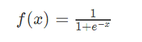
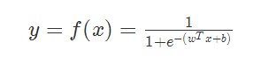
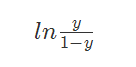

### Deeplearning Algorithms tutorial
谷歌的人工智能位于全球前列，在图像识别、语音识别、无人驾驶等技术上都已经落地。而百度实质意义上扛起了国内的人工智能的大旗，覆盖无人驾驶、智能助手、图像识别等许多层面。苹果业已开始全面拥抱机器学习，新产品进军家庭智能音箱并打造工作站级别Mac。另外，腾讯的深度学习平台Mariana已支持了微信语音识别的语音输入法、语音开放平台、长按语音消息转文本等产品，在微信图像识别中开始应用。全球前十大科技公司全部发力人工智能理论研究和应用的实现，虽然入门艰难，但是一旦入门，高手也就在你的不远处！
AI的开发离不开算法那我们就接下来开始学习算法吧！
回归方法是对数值型连续随机变量进行预测和建模的监督学习算法。其特点是标注的数据集具有数值型的目标变量。回归的目的是预测数值型的目标值。

常用的回归方法包括:
* 线性回归：使用超平面拟合数据集 
* 最近邻算法：通过搜寻最相似的训练样本来预测新样本的值
* 决策树和回归树：将数据集分割为不同分支而实现分层学习
* 集成方法：组合多个弱学习算法构造一种强学习算法，如随机森林（RF）和梯度提升树（GBM）等
* 深度学习：使用多层神经网络学习复杂模型

#### 逻辑回归

逻辑回归对应线性回归，但旨在解决分类问题，即将模型的输出转换为0/1值。逻辑回归直接对分类的可能性进行建模，无需事先假设数据的分布。

最理想的转换函数为单位阶跃函数（也称Heaviside函数），但单位阶跃函数是不连续的，没法在实际计算中使用。故而，在分类过程中更常使用对数几率函数（即sigmoid函数）：

这样，模型就变成了

如果将$y$看作是样本$x$作为正例的可能性，那么可以得到反应$x$作为正例的相对可能性对数几率（logit）

#### 逻辑回归算法

可以使用极大似然估计法来估计参数$w$和$b$

