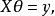
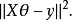
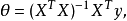
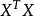
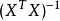
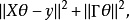
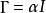
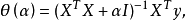
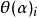

### Deeplearning Algorithms tutorial
谷歌的人工智能位于全球前列，在图像识别、语音识别、无人驾驶等技术上都已经落地。而百度实质意义上扛起了国内的人工智能的大旗，覆盖无人驾驶、智能助手、图像识别等许多层面。苹果业已开始全面拥抱机器学习，新产品进军家庭智能音箱并打造工作站级别Mac。另外，腾讯的深度学习平台Mariana已支持了微信语音识别的语音输入法、语音开放平台、长按语音消息转文本等产品，在微信图像识别中开始应用。全球前十大科技公司全部发力人工智能理论研究和应用的实现，虽然入门艰难，但是一旦入门，高手也就在你的不远处！
AI的开发离不开算法那我们就接下来开始学习算法吧！

#### 岭回归（Ridge Regression）

岭回归(ridge regression, Tikhonov regularization)是一种专用于共线性数据分析的有偏估计回归方法，实质上是一种改良的最小二乘估计法，通过放弃最小二乘法的无偏性，以损失部分信息、降低精度为代价获得回归系数更为符合实际、更可靠的回归方法，对病态数据的拟合要强于最小二乘法。

岭回归，又称脊回归、吉洪诺夫正则化（Tikhonov regularization），是对不适定问题（ill-posed problem)进行回归分析时最经常使用的一种正则化方法。
对于有些矩阵，矩阵中某个元素的一个很小的变动，会引起最后计算结果误差很大，这种矩阵称为“病态矩阵”。有些时候不正确的计算方法也会使一个正常的矩阵在运算中表现出病态。对于高斯消去法来说，如果主元（即对角线上的元素）上的元素很小，在计算时就会表现出病态的特征。

岭回归分析核心思想是采用最小二乘法原理来求解回归系数，最小二乘法思想背景：1801年，意大利天文学家朱赛普·皮亚齐发现了第一颗小行星谷神星。经过40天的跟踪观测后，由于谷神星运行至太阳背后，使得皮亚齐失去了谷神星的位置。随后全世界的科学家利用皮亚齐的观测数据开始寻找谷神星，但是根据大多数人计算的结果来寻找谷神星都没有结果。时年24岁的高斯计算了谷神星的轨道并进行了分析。奥地利天文学家海因里希·奥伯斯根据高斯计算出来的轨道重新发现了谷神星。

高斯使用的最小二乘法的方法发表于1809年他的著作《天体运动论》中，而法国科学家勒让德于1806年独立发现“最小二乘法”，但因不为世人所知而默默无闻。两人曾为谁最早创立最小二乘法原理发生争执。

1829年，高斯提供了最小二乘法的优化效果强于其他方法的证明，见高斯-马尔可夫定理。

回归分析中常用的最小二乘法是一种无偏估计。对于一个适定问题，X通常是列满秩的：

采用最小二乘法，定义损失函数为残差的平方，最小化损失函数:

也可以采用梯度下降法进行求解优化，也可以采用如下公式进行直接求解：

当X不是列满秩时，或者某些列之间的线性相关性比较大时，的行列式接近于0，即接近于奇异，上述问题变为一个不适定问题，此时，计算时误差会很大，传统的最小二乘法缺乏稳定性与可靠性。

因而，我们需要将不适定问题转化为适定问题：我们为上述损失函数加上一个正则化项，变为

其中，我们定义，于是：

其中I是单位矩阵。

随着的增大，各元素的绝对值均趋于不断变小，它们相对于正确值的偏差也越来越大。趋于无穷大时，趋于0。其中，随的改变而变化的轨迹，就称为岭迹。实际计算中可选非常多的  值，做出一个岭迹图，看看这个图在取哪个值的时候变稳定了，那就确定值了。
岭回归是对最小二乘回归的一种补充，它损失了无偏性，来换取高的数值稳定性，从而得到较高的计算精度。

#### 相关应用
岭回归是在自变量组成的信息矩阵的主对角线元素上人为的加入一个非负因子k，使得矩阵行列式不为零，以降低对回归系数估计的误差，提高估计精确度以及模型的平稳性。它是最小二乘法的补充，岭回归可以修复病态矩阵，达到较好的效果。

近年来，岭回归在经济、工业生产、工程技术、环境保护等方面已有一定的应用。

#### 应用案例

#### 优缺点
优点：可对变量之间共线性比较严重或病态数据偏多的数据类型作回归分析，对这类数据作回归得到的回归系数更符合实际，更可靠。另外，岭回归能让估计参数的波动范围变小，变的更稳定。

缺点：对系数的估计时，会损失部分信息、降低精度。同时岭回归方程的R平方值会稍低于普通的回归方法。
