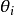

### Deeplearning Algorithms tutorial
谷歌的人工智能位于全球前列，在图像识别、语音识别、无人驾驶等技术上都已经落地。而百度实质意义上扛起了国内的人工智能的大旗，覆盖无人驾驶、智能助手、图像识别等许多层面。苹果业已开始全面拥抱机器学习，新产品进军家庭智能音箱并打造工作站级别Mac。另外，腾讯的深度学习平台Mariana已支持了微信语音识别的语音输入法、语音开放平台、长按语音消息转文本等产品，在微信图像识别中开始应用。全球前十大科技公司全部发力人工智能理论研究和应用的实现，虽然入门艰难，但是一旦入门，高手也就在你的不远处！
AI的开发离不开算法那我们就接下来开始学习算法吧！

#### Lasso算法(least absolute shrinkage and selection operator)

Lasso算法（least absolute shrinkage and selection operator，又译最小绝对值收敛和选择算子、套索算法）是一种同时进行特征选择和正则化（数学）的回归分析方法，旨在增强统计模型的预测准确性和可解释性，最初由斯坦福大学统计学教授Robert Tibshirani于1996年基于Leo Breiman的非负参数推断(Nonnegative Garrote, NNG)提出[1][2]。

Lasso算法最初用于计算最小二乘法模型，这个简单的算法揭示了很多估计量的重要性质，如估计量与岭回归（Ridge regression，也叫Tikhonov regularization）和最佳子集选择的关系，Lasso系数估计值(estimate)和软阈值（soft thresholding）之间的联系。它也揭示了当协变量共线时，Lasso系数估计值不一定唯一（类似标准线性回归）。Lasso是一种缩减方法，将回归系数收缩在一定的区域内。Lasso的主要思想是构造一个一阶惩罚函数获得一个精确的模型, 通过最终确定一些变量的系数为0进行特征筛选。以两个变量为例，标准线性回归的cost function还是可以用二维平面的等值线表示，而约束条件则与岭回归的圆不同，Lasso的约束条件可以用方形表示，如图:

相比圆，方形的顶点更容易与抛物面相交，顶点就意味着对应的很多系数为0，而岭回归中的圆上的任意一点都很容易与抛物面相交很难得到正好等于0的系数。这也就意味着，lasso起到了很好的筛选变量的作用。

