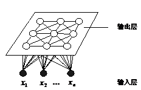
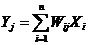
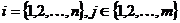
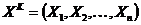

### Leeplearning Algorithms tutorial
谷歌的人工智能位于全球前列，在图像识别、语音识别、无人驾驶等技术上都已经落地。而百度实质意义上扛起了国内的人工智能的大旗，覆盖无人驾驶、智能助手、图像识别等许多层面。苹果业已开始全面拥抱机器学习，新产品进军家庭智能音箱并打造工作站级别Mac。另外，腾讯的深度学习平台Mariana已支持了微信语音识别的语音输入法、语音开放平台、长按语音消息转文本等产品，在微信图像识别中开始应用。全球前十大科技公司全部发力人工智能理论研究和应用的实现，虽然入门艰难，但是一旦入门，高手也就在你的不远处！
AI的开发离不开算法那我们就接下来开始学习算法吧！

#### SOM神经网络

芬兰Helsink大学Kohonen T.教授提出一种自组织特征映射网络SOM(Self-organizing feature Map)，又称Kohonen网络。Kohonen认为，一个神经网络接受外界输入模式时，将会分为不同的对应区域，各区域对输入模式有不同的响应特征，而这个过程是自动完成的。SOM网络正是根据这一看法提出的，其特点与人脑的自组织特性相类似。

A.自组织神经网络结构 
* (1)定义：自组织神经网络是无导师学习网络。它通过自动寻找样本中的内在规律和本质属性，自组织、自适应地改变网络参数与结构。
* (2)结构：层次型结构，具有竞争层。典型结构：输入层+竞争层。输入层：接受外界信息，将输入模式向竞争层传递，起“观察”作用。竞争层：负责对输入模式进行分析比较，寻找规律，并归类。

B.自组织神经网络的原理
* (1)分类与输入模式的相似性：分类是在类别知识等导师信号的指导下，将待识别的输入模式分配到各自的模式类中，无导师指导的分类称为聚类，聚类的目的是将相似的模式样本划归一类，而将不相似的分离开来，实现模式样本的类内相似性和类间分离性。由于无导师学习的训练样本中不含期望输出，因此对于某一输入模式样本应属于哪一类并没有任何先验知识。对于一组输入模式，只能根据它们之间的相似程度来分为若干类，因此，相似性是输入模式的聚类依据。
* (2)相似性测量：神经网络的输入模式向量的相似性测量可用向量之间的距离来衡量。常用的方法有欧氏距离法和余弦法两种。
* (3)竞争学习原理:竞争学习规则的生理学基础是神经细胞的侧抑制现象：当一个神经细胞兴奋后，会对其周围的神经细胞产生抑制作用。最强的抑制作用是竞争获胜的“唯我独兴”，这种做法称为“胜者为王”（Winner-Take-All）。竞争学习规则就是从神经细胞的侧抑制现象获得的。它的学习步骤为：A、向量归一化；B、寻找获胜神经元；C、网络输出与权调整；D、重新归一化处理。

SOM网络的拓扑结构：SOM网络共有两层。即：输入层和输出层。
* (1)输入层：通过权向量将外界信息汇集到输出层各神经元。输入层的形式与BP网相同，节点数与样本维数相同。
* (2)输出层：输出层也是竞争层。其神经元的排列有多种形式。分为一维线阵,二维平面阵和三维栅格阵。最典型的结构是二维形式。它更具大脑皮层的形象。输出层的每个神经元同它周围的其他神经元侧向连接，排列成棋盘状平面；输入层为单层神经元排列。

C.SOM权值调整域
* SOM网采用的算法，称为Kohonen算法，它是在胜者为王WTA(Winner-Take-All)学习规则基础上加以改进的，主要区别是调整权向量与侧抑制的方式不同，侧抑制是“封杀”式的。只有获胜神经元可以调整其权值，其他神经元都无权调整。Kohonen算法：获胜神经元对其邻近神经元的影响是由近及远，由兴奋逐渐变为抑制。换句话说，不仅获胜神经元要调整权值，它周围神经元也要不同程度调整权向量。

d.SOM网络运行原理
* SOM网络的运行分训练和工作两个阶段。在训练阶段，网络随机输入训练集中的样本，对某个特定的输入模式，输出层会有某个节点产生最大响应而获胜，而在训练开始阶段，输出层哪个位置的节点将对哪类输入模式产生最大响应是不确定的。当输入模式的类别改变时，二维平面的获胜节点也会改变。获胜节点周围的节点因侧向相互兴奋作用也产生较大影响，于是获胜节点及其优胜邻域内的所有节点所连接的权向量均向输入方向作不同程度的调整，调整力度依邻域内各节点距离获胜节点的远近而逐渐减小。网络通过自组织方式，用大量训练样本调整网络权值，最后使输出层各节点成为对特定模式类敏感的神经元，相应的权向量成为各输入模式的中心向量。并且当两个模式类的特征接近时，代表这两类的节点在位置上也接近。从而在输出层形成能反应样本模式类分布情况的有序特征图。

自组织映射网络（Kohonen）结构见图所示，图中上层为输出层，假定有个节点，输出层中的节点是以二维形式排成一个节点矩阵，输出节点之间也可能实现局部连接，它们中的每个节点是一个输入样本的代表。输入层处于下方，若输入向量为n维，那么输入节点有n个，输入节点与输出层的所有节点通过权值实现全互联。在输出层竞争是这样进行的，对于获胜的节点，在其周围Nj区域内的节点在不同的程度上得到兴奋，而在Nj区域以外的节点都被抑制，这个趋于Nj可以是正方形也可以是六角形，如图所示。区域Nj是时间t的函数，随着的增加，Nj的面积成比例缩小，最后剩下一个节点或一组节点，它们反映一类样本的属性。自组织映射网络为一个无教师指导的、自适应、自组织的网络。

* Kohonen 网络结构

* 对于任意一个输入节点i和输出节点j有：

* Nj(t)的形状变化情况

自组织映射学习算法：假定共有K个输入模式，对于某个输入模式通过竞争，逐渐收敛到样本空间所划分的K个子集的中心。当某一模式输入时，对某一输出节点给予最大的刺激，以指示该类模式的所属区域，而同时对获胜周围的一些节点给予较大的刺激。当另一输入模式输入时，获胜区域移到其它区域。

在训练过程中定义获胜节点的邻域为Nj(t)，表示在时刻t以节点Nj为中心的某一半径内的所有节点，随着训练过程的进行Nj(t)的半径将逐渐缩小，最后只剩Nj(t)本身。即在初始阶段不但对获胜节点Nj(t)调整权值，也对其周围节点调整权值，直到最后仅对Nj(t)调整权值。保证对于某一类输入模式，获胜节点做出最大的响应，而相邻节点做出较大的响应。几何上相邻的节点代表特征相近的模式。Kohonen网络的具体算法为：

① 连接权值的初始化

② 对网络输入一个样本模式。

③ 计算Xk与全部输出节点间的权值向量W的距离

④ 选择有最小距离的节点Nj*为竞争获胜节点

⑤ 调整权值

其中，0＜α(t)＜1，为增益函数，随着时间t而递减。β(Nj,Nj*)，随着Nj*距离递减。
⑥ 若还有输入样本则转②，当所有的样本输入完，且满足：

或者完成指定的学习次数后算法结束，否则转②。

α(t)和Nj*(t)没有一般化数学方法，凭经验选取。初始时，Nj*(t)选取较大，后逐渐变小，α(t)开始时较大，后逐渐变为0。

#### 相关应用
SOM网络是自组织竞争型神经网络的一种，该网络为无监督学习网络，能够识别环境特征并自动聚类。
